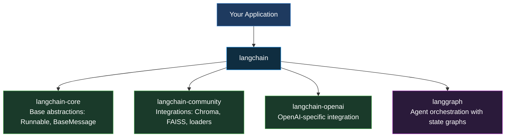
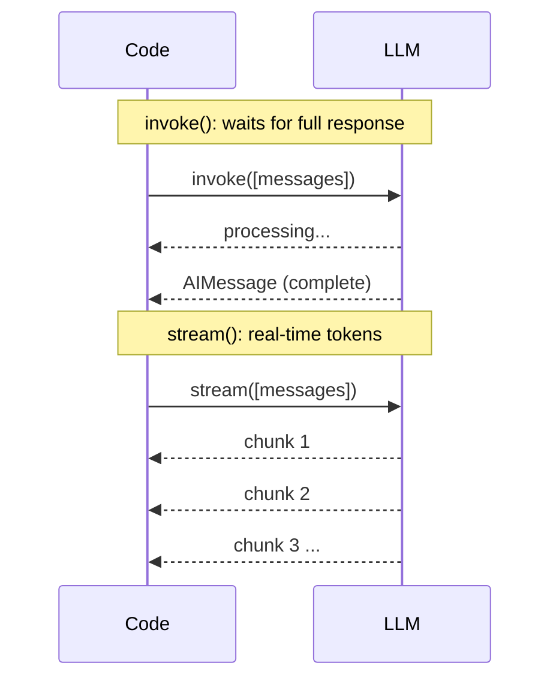
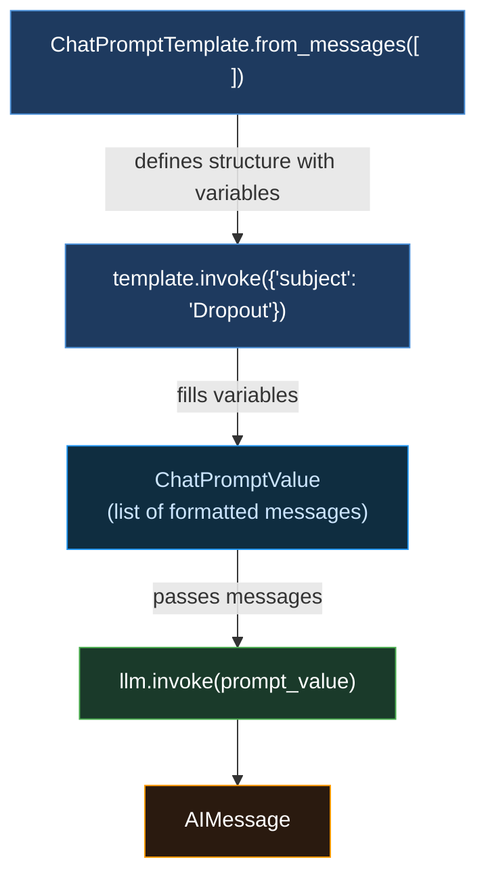
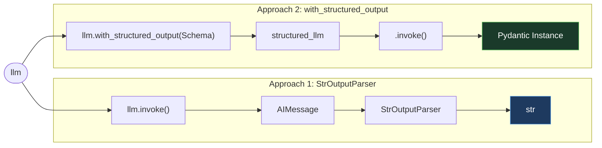
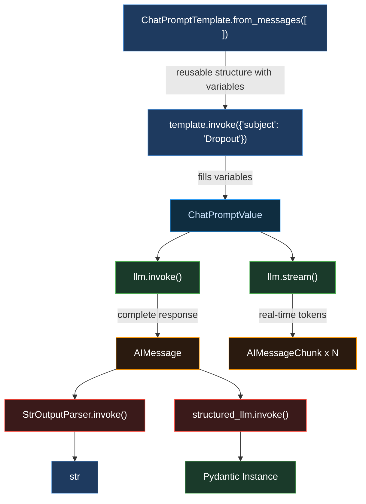

# 🦜 LangChain: Notebook 01: Core Concepts

> **LangChain from Scratch Series** · Notebook 01 / 05

This notebook covers the **4 fundamental concepts** you need to master before anything else in LangChain:

| # | Concept | What we learn |
|---|---------|---------------|
| 1 | **Models** | Initialize an LLM, invoke / stream / batch |
| 2 | **Messages** | SystemMessage, HumanMessage, AIMessage |
| 3 | **Prompt Templates** | ChatPromptTemplate, dynamic variables |
| 4 | **Output Parsers** | StrOutputParser, with_structured_output |


### Why LangChain?

LangChain is a framework that solves 4 concrete problems when building LLM-powered apps:

- **Portability**: use any LLM (OpenAI, Anthropic, Mistral...) with the same interface
- **Composition**: avoid spaghetti code with clean, modular chains
- **Prompt management**: reusable templates with dynamic variables
- **Ecosystem**: 100+ ready-to-use integrations (vector stores, loaders, tools)

### Package Architecture



## ⚙️ Setup

### Why OpenRouter?

OpenRouter is a service that gives access to dozens of models (GPT, Claude, Mistral, LLaMA...) through a **single OpenAI-compatible API**. It has a free tier: perfect for learning without spending.

It works with `langchain-openai` because it exposes exactly the same interface as OpenAI. We only change two things: `base_url` and `api_key`.

```python
# Install required packages
!pip install langchain langchain-openai langchain-core python-dotenv -q
```

```python
import warnings
warnings.filterwarnings("ignore")

# API key management
# Option 1: Google Colab Secrets (recommended)
# from google.colab import userdata
# OPENROUTER_API_KEY = userdata.get('OPENROUTER_API_KEY')

# Option 2: Direct variable (local dev only — never commit this)
OPENROUTER_API_KEY = "your-api-key-here"
```

## 1. 🤖 Models

### What is it?

The **ChatModel** is the central component of LangChain: it's the interface that lets you talk to any LLM with the same syntax, regardless of the provider.

### Two ways to initialize a model

| Class | Package | Coupling | Usage |
|-------|---------|----------|-------|
| `ChatOpenAI` | `langchain-openai` | Strong (provider-specific) | Simple, explicit |
| `init_chat_model` | `langchain` | Weak (universal) | Multi-provider production |

### The Runnable Interface

Every LangChain component implements the **Runnable** interface: the base contract that guarantees every component exposes the same 3 methods:

| Method | Behavior | Returns |
|--------|----------|---------|
| `invoke()` | Waits for the complete response | `AIMessage` |
| `stream()` | Returns tokens in real-time | Generator of `AIMessageChunk` |
| `batch()` | Sends multiple requests in parallel | List of `AIMessage` |

### invoke() vs stream(): behavior



```python
from langchain_openai import ChatOpenAI

# Initialize the model via OpenRouter
llm = ChatOpenAI(
    api_key=OPENROUTER_API_KEY,
    base_url="https://openrouter.ai/api/v1",
    model="arcee-ai/trinity-large-preview:free"  # free 400B params model
)

print("Model initialized:", llm.model_name)
```

## 2. 💬 Messages

### What is it?

**Messages** are the fundamental unit of communication with an LLM in LangChain. They are not simple strings: they are **structured objects** that carry a role, content, and metadata.

### The 4 message types

| Class | Role | When to use |
|-------|------|-------------|
| `SystemMessage` | Instructions to the model | Define behavior, tone, context |
| `HumanMessage` | User message | The question or task |
| `AIMessage` | Model response | Returned by `invoke()` |
| `ToolMessage` | Tool result | In agent workflows |

### Alternative: dictionaries

LangChain also accepts dictionaries `{"role": "user", "content": "..."}`: it automatically converts them into Message objects internally. Both syntaxes are valid.

```python
from langchain_core.messages import SystemMessage, HumanMessage, AIMessage

# Create messages
system_msg = SystemMessage(content="You are an ML expert. Always answer briefly.")
human_msg = HumanMessage(content="What is Dropout?")

print("SystemMessage:", system_msg)
print("HumanMessage :", human_msg)
```

```python
# invoke() — waits for the complete response, returns an AIMessage
response = llm.invoke([system_msg, human_msg])

print("Returned type:", type(response))
print("Content      :", response.content)
```

```python
# stream() — returns tokens in real-time, token by token
# Use chunk.content — the official native attribute (not chunk.text)
for chunk in llm.stream([system_msg, human_msg]):
    print(chunk.content, end="", flush=True)
```

## 3. 📝 Prompt Templates

### The problem it solves

With `SystemMessage` and `HumanMessage`, messages are **static**: the text is fixed when you write them. `ChatPromptTemplate` solves this with **variables in curly braces** `{variable}`: like an f-string, but managed cleanly by LangChain.

### from_messages(): a factory method

`from_messages()` is a `classmethod`: you call it **directly on the class**, not on an instance.

```python
# Wrong: instantiates first, then calls the method
ChatPromptTemplate().from_messages([...])

# Correct: calls directly on the class
ChatPromptTemplate.from_messages([...])
```

### Full flow



```python
from langchain_core.prompts import ChatPromptTemplate

# Create a template with a dynamic variable {subject}
# Pass tuples ("role", "text") — not Message objects
template = ChatPromptTemplate.from_messages([
    ("system", "You are an ML expert. Always answer briefly."),
    ("human", "Hi, I want you to explain {subject} to me")
])

# invoke() with a variable dictionary → returns a ChatPromptValue
prompt_value = template.invoke({"subject": "Dropout"})

print("Returned type:", type(prompt_value))
print("Content      :", prompt_value)
```

```python
# The ChatPromptValue is passed directly to the llm
for chunk in llm.stream(prompt_value):
    print(chunk.content, end="", flush=True)
```

## 4. 🔧 Output Parsers & Structured Output

### The problem it solves

`llm.invoke()` always returns an `AIMessage`. In most cases you want either **just the text** or a **structured Python object**.

| Approach | Tool | Returns | Streaming | Use case |
|----------|------|---------|-----------|----------|
| Parser | `StrOutputParser` | `str` | ✅ via LCEL | Free-form text |
| Structured | `with_structured_output()` | Pydantic instance | ❌ | Structured data |




### 4.1 StrOutputParser

**What is it?** A Runnable that takes an `AIMessage` and extracts only the `.content` as a pure Python `str`.

**Why not just `.content` directly?** Because `StrOutputParser` is a Runnable: it can be composed in a chain with `|`. `.content` is imperative code, not composable. We'll see the difference in Notebook 02.

```python
from langchain_core.output_parsers import StrOutputParser

parser = StrOutputParser()

# invoke() — receives an AIMessage, returns a str
response = llm.invoke(prompt_value)
parsed = parser.invoke(response)

print("Type before parser:", type(response))  # AIMessage
print("Type after parser :", type(parsed))    # str
print("\nContent:", parsed)
```

### ⚠️ Limitation: End-to-end streaming with StrOutputParser

```python
# Works: but loses streaming (invoke waits for the complete response)
parser.invoke(llm.invoke(prompt_value))

# Does not work: StrOutputParser expects an AIMessage, not a generator
parser.stream(llm.stream(prompt_value))  # → ValidationError
```

**The real solution** is **LCEL** with the `|` operator:

```python
chain = template | llm | parser
chain.stream({"subject": "Dropout"})  # end-to-end streaming
```

> 📌 LCEL is covered in detail in **Notebook 02**.


### 4.2 with_structured_output(): Structured Output with Pydantic

**What is it?** A method on the `llm` that returns a **new augmented llm** that forces the model to respond according to a precise Pydantic schema. Instead of an `AIMessage`, it returns directly an **instance of your schema**.

**3 supported schema formats:**

| Format | Validation | Returns | Best for |
|--------|-----------|---------|----------|
| `Pydantic BaseModel` | ✅ Automatic | Pydantic instance | Data extraction, production |
| `TypedDict` | ❌ Manual | `dict` | Simple cases without validation |
| `JSON Schema` | ❌ Manual | `dict` | Maximum interoperability |

**No streaming**: Pydantic needs to receive all fields at once to validate the complete structure.

```python
from pydantic import BaseModel, Field

# Define the Pydantic schema
# Field(description=...) guides the model on what to put in each field
class MLConcept(BaseModel):
    name: str = Field(..., description="The name of the ML concept")
    definition: str = Field(..., description="A clear and concise definition of the concept")
    example: str = Field(..., description="A concrete real-world application example")

# Create the structured_llm — new object, the original llm stays intact
structured_llm = llm.with_structured_output(MLConcept)

# invoke() only — no stream() with structured output
response = structured_llm.invoke(prompt_value)

print("Returned type:", type(response))  # MLConcept — no longer an AIMessage!
print()
print("name      :", response.name)
print("definition:", response.definition)
print("example   :", response.example)
```

## 🗺️ Summary: Full Notebook 01 Pipeline



### Key concepts to remember

**Runnable**: the common interface of all LangChain components. Guarantees `invoke()`, `stream()`, `batch()` everywhere.

**ChatPromptTemplate**: separates the prompt structure from the data. Takes a `dict` of variables, returns a `ChatPromptValue`.

**StrOutputParser**: extracts `.content` from an `AIMessage` as a `str`. Chainable with `|` in LCEL.

**with_structured_output()**: forces the model to respect a Pydantic schema. Returns an instance directly.


### 🔜 Notebook 02: LCEL & Chains

In the next notebook we'll see how to chain all these components with the `|` operator to build clean, streamable, reusable pipelines:

```python
chain = template | llm | parser
chain.stream({"subject": "Dropout"})  # end-to-end streaming
```
