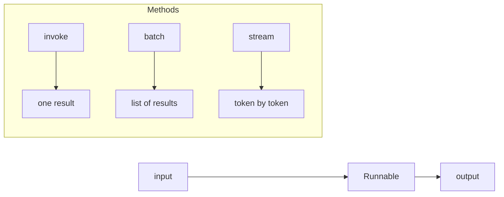
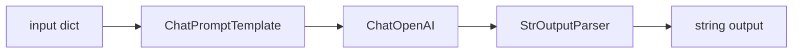
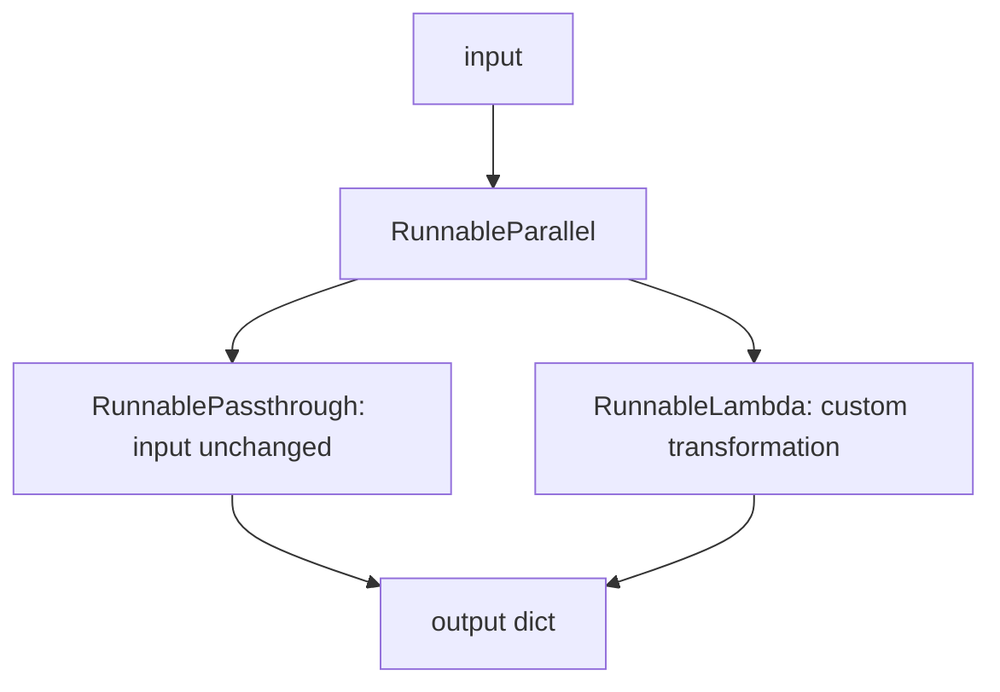
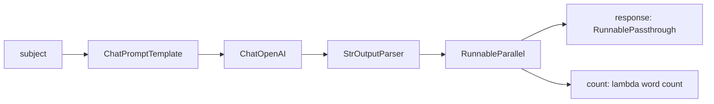
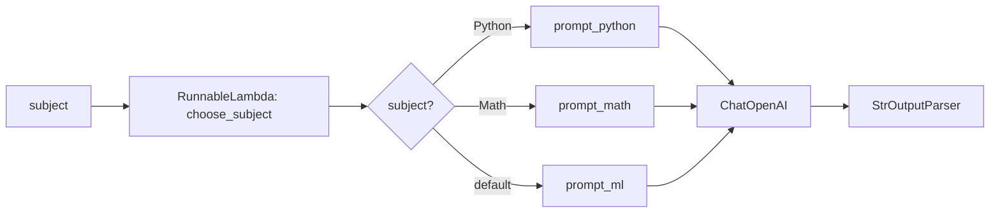

# NB02 : LCEL & Chains

> A hands-on guide to LangChain Expression Language (LCEL), the Runnable interface, and chain composition.

## Table of Contents

| # | Section | Concepts |
|---|---------|----------|
| 1 | **Setup** | Imports, API configuration |
| 2 | **The Runnable Interface** | `.invoke()`, `.batch()`, `.stream()` |
| 3 | **The Pipe Operator** | `\|`, `RunnableSequence`, `end-to-end streaming` |
| 4 | **Utility Runnables** | `RunnablePassthrough`, `RunnableParallel`, `RunnableLambda` |
| 5 | **Use Case 1** | ML chain with word count |
| 6 | **Use Case 2** | Subject-based routing chain |

## 1. Setup

```python
import warnings
warnings.filterwarnings('ignore')

import os
from dotenv import load_dotenv
load_dotenv()

OPENROUTER_API_KEY = os.getenv('OPENROUTER_API_KEY')
```

```python
from langchain_openai import ChatOpenAI
from langchain_core.messages import HumanMessage, SystemMessage
from langchain_core.prompts import ChatPromptTemplate
from langchain_core.output_parsers import StrOutputParser
from langchain_core.runnables import (
    RunnablePassthrough,
    RunnableParallel,
    RunnableLambda
)

llm = ChatOpenAI(
    api_key=OPENROUTER_API_KEY,
    base_url="https://openrouter.ai/api/v1",
    model="arcee-ai/trinity-large-preview:free"
)

parser = StrOutputParser()
```

## 2. The Runnable Interface

Every component in LangChain implements the **Runnable** interface.
This is the common contract that makes all components composable with the pipe operator `|`.

| Method | Description | Async version |
|--------|-------------|---------------|
| `.invoke(input)` | Run once, return one output | `.ainvoke()` |
| `.batch([input1, input2])` | Run on multiple inputs in parallel | `.abatch()` |
| `.stream(input)` | Stream output token by token | `.astream()` |



> Every LLM, Prompt, Parser, and Retriever is a Runnable. They share these methods; only input/output types differ.

```python
# invoke: one input, one AIMessage output
response = llm.invoke([HumanMessage("How are you today?")])
print(response.content)
print(type(response))
```

```python
# stream: one input, tokens yielded one by one
for chunk in llm.stream([HumanMessage("Who are you?")]):
    print(chunk.content, end="", flush=True)
```

```python
# batch: multiple inputs, list of AIMessage outputs
responses = llm.batch([
    [HumanMessage("How are you?")],
    [HumanMessage("What is LangChain?")],
    [HumanMessage("What is RAG?")]
])

print(type(responses))
print(f"Number of responses: {len(responses)}")
```

## 3. The Pipe Operator and RunnableSequence

The `|` operator chains Runnables together into a `RunnableSequence`.
The output of each step becomes the input of the next.



> The chain is defined lazily: no execution happens until `.invoke()`, `.stream()`, or `.batch()` is called.

```python
# Building a basic LCEL chain
prompt = ChatPromptTemplate.from_messages([
    ("system", "You are a specialized ML expert, be helpful and kind."),
    ("human", "What is {subject} in ML?")
])

chain = prompt | llm | parser
print(type(chain))
```

```python
# invoke: the chain expects what the first component needs
result = chain.invoke({"subject": "Dropout"})
print(result)
```

```python
# end-to-end streaming: works because the full chain is built with |
for token in chain.stream({"subject": "Dropout"}):
    print(token, end="", flush=True)
```

## 4. Utility Runnables

These Runnables are data management tools; they do not call the LLM.
They control how data flows and is transformed between components.

| Runnable | Role |
|----------|------|
| `RunnablePassthrough` | Passes input unchanged |
| `RunnableParallel` | Runs multiple branches on the same input simultaneously |
| `RunnableLambda` | Wraps any Python function into a Runnable |



```python
# RunnablePassthrough: passes input as-is
# RunnableParallel: runs branches simultaneously on the same input
parallel = RunnableParallel(
    user_data=RunnablePassthrough(),
    transformed_data=lambda x: x["num"] * 2
)

parallel.invoke({"num": 5})
```

```python
# RunnableLambda: wraps a Python function into a Runnable
def to_upper(x: str) -> str:
    return x.upper()

def add_exclamation(x: str) -> str:
    return x + "!"

runnable_upper = RunnableLambda(to_upper)
runnable_exclaim = RunnableLambda(add_exclamation)

# compose two RunnableLambdas with |
lambda_chain = runnable_upper | runnable_exclaim
lambda_chain.invoke("hello")
```

## 5. Use Case 1: ML Chain with Word Count

A chain that answers a question about an ML concept and returns both the response and its word count in parallel.



```python
ml_prompt = ChatPromptTemplate.from_messages([
    ("system", "You are a specialized ML expert, be helpful and kind."),
    ("human", "What is {subject} in ML?")
])

ml_parallel = RunnableParallel(
    response=RunnablePassthrough(),
    count=lambda x: len(x.split(" "))
)

ml_chain = ml_prompt | llm | parser | ml_parallel

result = ml_chain.invoke({"subject": "Dropout"})
print(f"Word count: {result['count']}")
print(f"\nResponse:\n{result['response']}")
```

## 6. Use Case 2: Subject-Based Routing Chain

A chain that routes the input to a specialized prompt based on the subject: Python, Math, or ML.



```python
prompt_ml = ChatPromptTemplate.from_messages([
    ("system", "You are an ML expert, be helpful and insightful."),
    ("human", "Help me understand {subject}.")
])

prompt_math = ChatPromptTemplate.from_messages([
    ("system", "You are a math expert, be helpful and insightful."),
    ("human", "Help me understand {subject}.")
])

prompt_python = ChatPromptTemplate.from_messages([
    ("system", "You are a Python expert, be helpful and insightful."),
    ("human", "Help me understand {subject}.")
])


def choose_subject(x: dict):
    """Route to the appropriate prompt based on subject."""
    if x["subject"] == "Python":
        return prompt_python
    elif x["subject"] == "Math":
        return prompt_math
    return prompt_ml


routing_chain = RunnableLambda(choose_subject) | llm | parser

# test routing
print(routing_chain.invoke({"subject": "Python"}))
```

```python
# test all routes
for subject in ["Python", "Math", "ML"]:
    print(f"--- {subject} ---")
    result = routing_chain.invoke({"subject": subject})
    print(result[:200])  # print first 200 chars
    print()
```

## Summary

| Concept | Class | Role |
|---------|-------|------|
| Runnable interface | All components | `.invoke()`, `.batch()`, `.stream()` |
| Chain composition | `RunnableSequence` | Created by `\|` operator |
| Pass data unchanged | `RunnablePassthrough` | Preserve original input |
| Parallel execution | `RunnableParallel` | Run multiple branches simultaneously |
| Custom functions | `RunnableLambda` | Wrap any Python function into a Runnable |

> Next: **NB03: RAG** (Retrieval-Augmented Generation)
