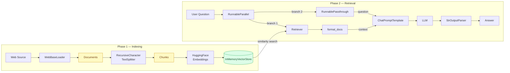

# NB03: Retrieval-Augmented Generation (RAG)

## Overview

RAG is a dual-pipeline system that solves two fundamental LLM limitations:
- **Hallucination**: LLMs generate plausible but incorrect information when they lack knowledge
- **Knowledge cutoff**: LLMs are not trained on recent or private data

RAG solves this by retrieving relevant documents at runtime and injecting them as context into the prompt, so the LLM generates answers grounded in real, up-to-date information.



## Key Concepts

| Concept | LangChain Class | Role |
|---|---|---|
| Document | `langchain_core.documents.Document` | Standard container: `page_content` + `metadata` |
| Loader | `WebBaseLoader` | Fetch and parse external sources into Documents |
| Splitter | `RecursiveCharacterTextSplitter` | Split large Documents into smaller chunks |
| Embeddings | `HuggingFaceEmbeddings` | Convert text chunks into numerical vectors |
| VectorStore | `InMemoryVectorStore` | Store and search vectors by similarity |
| Retriever | `VectorStoreRetriever` | Runnable wrapper around VectorStore for LCEL chains |

## 1. Setup

```python
!pip install langchain_core langchain[openai] langchain_community langchain_huggingface sentence-transformers -q
```

```python
import warnings
warnings.filterwarnings('ignore')

# Document loading and splitting
from langchain_community.document_loaders import WebBaseLoader
from langchain_text_splitters import RecursiveCharacterTextSplitter

# Embeddings and vector store
from langchain_huggingface import HuggingFaceEmbeddings
from langchain_core.vectorstores import InMemoryVectorStore

# LLM and chain components
from langchain_openai import ChatOpenAI
from langchain_core.prompts import ChatPromptTemplate
from langchain_core.output_parsers import StrOutputParser
from langchain_core.runnables import RunnableParallel, RunnablePassthrough, RunnableLambda
from langchain_core.documents import Document

# Verify Runnable interface
from langchain_core.runnables import Runnable
```

```python
import os

OPENROUTER_API_KEY = os.getenv("OPENROUTER_API_KEY", "your-openrouter-api-key")

llm = ChatOpenAI(
    api_key=OPENROUTER_API_KEY,
    base_url="https://openrouter.ai/api/v1",
    model="arcee-ai/trinity-large-preview:free"
)

parser = StrOutputParser()
```

## 2. Document Loading

A `Document` is LangChain's standard container for text data. Every loader, splitter, and retriever works with this object.

```
Document
├── page_content  →  the raw text
└── metadata      →  contextual info: source, title, language, page...
```

**Document Loaders** are adapters that convert external sources (URLs, PDFs, DOCX, Notion...) into lists of `Document`. They all live in `langchain_community.document_loaders` and share the same `.load()` interface.

```
Document Loaders
├── WebBaseLoader     ← from URL
├── PyPDFLoader       ← from PDF
├── Docx2txtLoader    ← from DOCX
├── TextLoader        ← from .txt
└── ...               ← all return List[Document]
```

```python
# Load Wikipedia article on Artificial Intelligence
loader = WebBaseLoader(web_paths=("https://fr.wikipedia.org/wiki/Intelligence_artificielle",))
docs = loader.load()

print(f"Number of documents: {len(docs)}")
print(f"Document type: {type(docs[0])}")
print(f"Metadata: {docs[0].metadata}")
print(f"\nFirst 300 characters:\n{docs[0].page_content[:300]}")
```

## 3. Text Splitting

The loaded document contains the entire Wikipedia page (~50k+ characters). This is too large for two reasons:
- LLMs have a limited context window
- Sending the full document on every query wastes tokens and dilutes relevance

**`RecursiveCharacterTextSplitter`** splits text by trying separators from largest to smallest: `\n\n` (paragraphs) then `\n` (lines) then characters. This keeps semantic units intact as much as possible.

Key parameters:
- `chunk_size`: maximum characters per chunk
- `chunk_overlap`: characters shared between consecutive chunks, prevents cutting ideas in half
- `add_start_index`: adds the character position in the original document to `metadata`

Each chunk remains a `Document` with the same `metadata` inherited from the parent.

```python
text_splitter = RecursiveCharacterTextSplitter(
    chunk_size=1000,
    chunk_overlap=200,
    add_start_index=True
)

splits = text_splitter.split_documents(docs)

print(f"Number of chunks: {len(splits)}")
print(f"Chunk type: {type(splits[0])}")
print(f"Metadata (with start_index): {splits[10].metadata}")
print(f"\nSample chunk content:\n{splits[10].page_content}")
```

## 4. Embeddings and VectorStore

### Embeddings

An embedding converts text into a numerical vector that captures its semantic meaning. Two semantically similar texts will produce vectors that are close in the vector space.

```
"L'IA apprend des données"  →  [0.23, -0.81, 0.45, ...]  (384 dimensions)
"Machine learning uses data" →  [0.21, -0.79, 0.43, ...]  (close vectors: similar meaning)
"La pizza est bonne"         →  [-0.54, 0.32, -0.11, ...] (far vector: different meaning)
```

The process: tokenize text → each token gets an internal vector → pooling produces one single vector per chunk.

| Model | Dimensions | Cost |
|---|---|---|
| `all-MiniLM-L6-v2` (HuggingFace) | 384 | Free, local |
| `text-embedding-3-small` (OpenAI) | 1536 | Paid API |
| `text-embedding-3-large` (OpenAI) | 3072 | Paid API |

### VectorStore

`InMemoryVectorStore` stores all (vector, Document) pairs in RAM. It disappears when the session ends. For production, use persistent stores like Chroma (local), Supabase/pgvector (cloud, free tier), Pinecone, or FAISS.

```python
# Initialize HuggingFace embeddings model (free, runs locally)
embeddings = HuggingFaceEmbeddings(
    model_name="all-MiniLM-L6-v2"
)

# Build vectorstore: embeds all chunks and stores (vector, Document) pairs in RAM
vectorstore = InMemoryVectorStore.from_documents(
    documents=splits,
    embedding=embeddings
)

print(f"VectorStore type: {type(vectorstore)}")
print(f"Is Runnable: {isinstance(vectorstore, Runnable)}")
```

## 5. Retriever

The VectorStore knows how to store and search vectors, but it does not implement the `Runnable` interface. It cannot be used directly in a LCEL chain with the `|` operator.

`.as_retriever()` wraps the VectorStore into a `VectorStoreRetriever`, which is a `Runnable`. It inherits the full Runnable interface: `.invoke()`, `.batch()`, `.stream()`.

```
Runnable
└── BaseRetriever
    └── VectorStoreRetriever   ← .as_retriever() returns this
```

Input: `str` (the user question)
Output: `List[Document]` (the k most similar chunks)

```python
retriever = vectorstore.as_retriever(search_kwargs={"k": 3})

print(f"Retriever type: {type(retriever)}")
print(f"Is Runnable: {isinstance(retriever, Runnable)}")

# Test retrieval
retrieved_docs = retriever.invoke("Qu'est-ce que l'apprentissage automatique ?")
print(f"\nRetrieved {len(retrieved_docs)} chunks")
print(f"\nMost relevant chunk:\n{retrieved_docs[0].page_content}")
```

## 6. RAG Chain

The full RAG chain connects all components using LCEL's pipe operator `|`.

### Why RunnableParallel comes first

The retriever takes the question as input but returns only a list of Documents. The question is lost after the retriever. We need both `{context}` and `{question}` in the prompt.

`RunnableParallel` acts as a junction: it captures the question first, then runs two branches simultaneously on the same input:

```
question (str)
        ↓
RunnableParallel
├── context  = retriever | format_docs  →  str (formatted chunks)
└── question = RunnablePassthrough()    →  str (original question preserved)
        ↓
{"context": "...", "question": "..."}
        ↓
ChatPromptTemplate  →  LLM  →  StrOutputParser
```

### format_docs

The retriever returns `List[Document]`. The prompt template expects a `str` for `{context}`. `format_docs` converts the list into a clean, readable string before injection.

```python
def format_docs(docs: list[Document]) -> str:
    """Convert a list of Documents into a single formatted string for the prompt context."""
    return "\n\n".join(doc.page_content for doc in docs)
```

```python
# {context} in system message: the LLM's knowledge base for this query
# {question} in human message: what the user is asking
prompt = ChatPromptTemplate.from_messages([
    ("system", """You are a helpful AI assistant. 
Answer the user's question based ONLY on the following context.
If the answer is not in the context, say you don't know.

Context:
{context}"""),
    ("human", "{question}")
])
```

```python
# Full RAG chain
rag_chain = (
    RunnableParallel(
        context=retriever | RunnableLambda(format_docs),
        question=RunnablePassthrough()
    )
    | prompt
    | llm
    | parser
)
```

```python
response = rag_chain.invoke("Qu'est-ce que l'apprentissage automatique ?")
print(response)
```

## 7. Summary

| Component | Class | Input | Output |
|---|---|---|---|
| Loader | `WebBaseLoader` | URL | `List[Document]` |
| Splitter | `RecursiveCharacterTextSplitter` | `List[Document]` | `List[Document]` (chunks) |
| Embeddings | `HuggingFaceEmbeddings` | `str` | `List[float]` (vector) |
| VectorStore | `InMemoryVectorStore` | `List[Document]` + embeddings | stored index |
| Retriever | `VectorStoreRetriever` | `str` (question) | `List[Document]` |
| format_docs | `RunnableLambda` | `List[Document]` | `str` |
| Prompt | `ChatPromptTemplate` | `{context, question}` | `ChatPromptValue` |
| LLM | `ChatOpenAI` | `ChatPromptValue` | `AIMessage` |
| Parser | `StrOutputParser` | `AIMessage` | `str` |

**Next: NB04: Tools and Agents**
