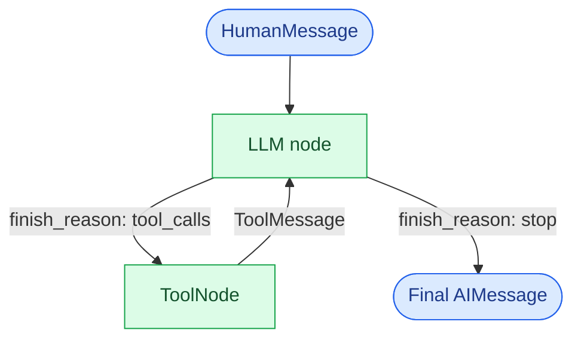
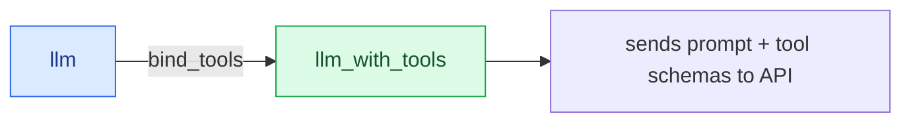
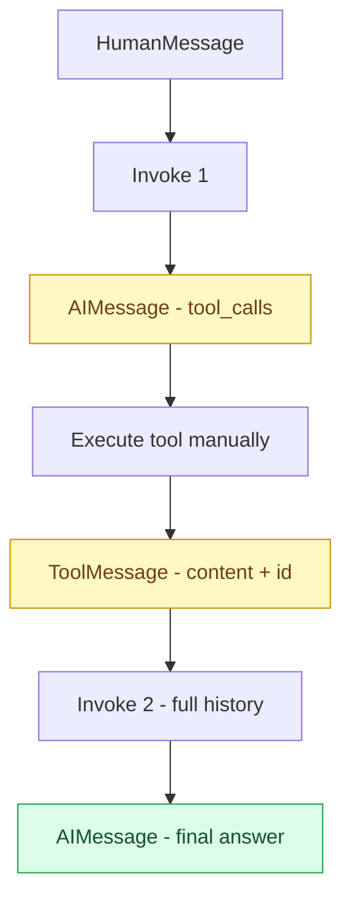
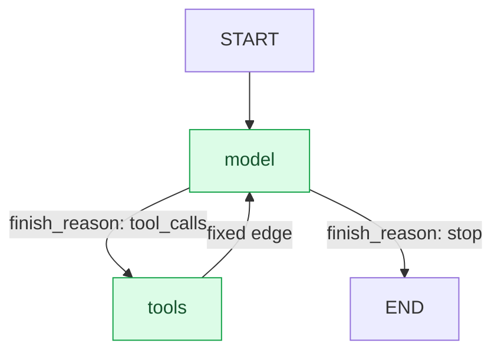

# NB04 - Tools and Agents

In this notebook, we explore how to extend LLM capabilities using **Tools** and **Agents**.

We cover three progressive levels:

- **Section 1 - Tools**: defining callable functions the LLM can use
- **Section 2 - Tool Calling (low-level)**: understanding the manual ReAct loop
- **Section 3 - Agent (high-level)**: automating the loop with LangGraph



## Setup

```python
# !pip install langchain_core langchain[openai] langgraph
```

```python
import warnings
warnings.filterwarnings("ignore")

import os
from langchain_openai import ChatOpenAI
from langchain_core.tools import tool
from langchain_core.messages import HumanMessage, ToolMessage
```

```python
OPENROUTER_API_KEY = os.environ.get("OPENROUTER_API_KEY", "your-api-key-here")

llm = ChatOpenAI(
    api_key=OPENROUTER_API_KEY,
    base_url="https://openrouter.ai/api/v1",
    model="arcee-ai/trinity-large-preview:free",
)
```

## Section 1: Tools

A **tool** is a Python function decorated with `@tool` that exposes three things to the LLM: a name, a description, and an args schema.

Under the hood, `@tool` converts the function into a `StructuredTool` object, which is also a `Runnable`.

```mermaid
graph LR
    A[Python function] -->|@tool decorator| B[StructuredTool]
    B --> C[.name]
    B --> D[.description]
    B --> E[.args]
    B --> F[.invoke]

    style A fill:#DBEAFE,stroke:#2563EB,color:#1E3A8A
    style B fill:#DCFCE7,stroke:#16A34A,color:#14532D
```

**Key rules:**
- Type hints are **required**: they define the JSON schema sent to the LLM
- The docstring is **critical**: the LLM reads it word-for-word to decide when to use the tool
- Use `snake_case` for tool names: some providers reject names with spaces or special characters
- `invoke()` is the **only** way to call a tool: `StructuredTool` is not directly callable

**`@tool` advanced parameters:**

| Parameter | Description |
|---|---|
| `name` | Override tool name (default: function name) |
| `description` | Override description (default: docstring) |
| `return_direct` | If `True`, return the result directly to the user without passing it back through the LLM |
| `parse_docstring` | If `True`, parse Google-style `Args:` section for per-argument descriptions |
| `args_schema` | Custom Pydantic model for richer argument descriptions and validation |

### 1.1 Creating Tools

```python
@tool
def multiply(a: int, b: int) -> int:
    """Use this function when the user asks to perform a multiplication operation."""
    return a * b


@tool
def add(a: int, b: int) -> int:
    """Use this function when the user asks to perform an addition operation."""
    return a + b


@tool
def subtract(a: int, b: int) -> int:
    """Use this function when the user asks to perform a subtraction operation."""
    return a - b
```

### 1.2 Inspecting a Tool

Once decorated, the function becomes a `StructuredTool` with three attributes the LLM reads directly.

```python
# StructuredTool inherits from Runnable
from langchain_core.runnables import Runnable

print(type(multiply))                  # langchain_core.tools.structured.StructuredTool
print(isinstance(multiply, Runnable))  # True
```

```python
# The LLM reads exactly these three attributes to decide when and how to use the tool
print("name       :", multiply.name)
print("description:", multiply.description)
print("args       :", multiply.args)

# args is a JSON schema generated from type hints:
#   int   -> {"type": "integer"}
#   str   -> {"type": "string"}
#   float -> {"type": "number"}
```

### 1.3 Invoking a Tool

Since `StructuredTool` is a `Runnable`, the only valid way to call it is via `.invoke()` with a dictionary of arguments.

```python
# Correct: use .invoke() with a dict
multiply.invoke({"a": 3, "b": 4})  # 12
```

```python
# Wrong: StructuredTool is not directly callable
try:
    multiply(3, 4)
except TypeError as e:
    print(f"TypeError: {e}")  # 'StructuredTool' object is not callable
```

## Section 2: Tool Calling (Low-Level)

Before using an agent, it is essential to understand what happens **under the hood**.
This section manually implements the ReAct loop that agents automate.

### Function Calling vs Tool Calling

| Concept | Level | Description |
|---|---|---|
| **Function Calling** | API | The LLM returns a JSON intent to call a function. The developer handles execution manually. Open loop. |
| **Tool Calling** | Framework | LangChain closes the loop: definition, binding, execution, and result injection are all automated. |

### How `bind_tools` Works

`llm.bind_tools(tools)` creates a **new augmented LLM object** that sends tool schemas to the API alongside every prompt. The original LLM is unchanged.

This is the same pattern as `with_structured_output()`: both create a new object without modifying the original.



```python
# The original llm object is left unchanged
tooled_llm = llm.bind_tools([multiply, add, subtract])
```

### 2.1 The Tool Calling Mechanism

When the LLM decides to call a tool, it does **not** return text. It returns an `AIMessage` with:
- `finish_reason: "tool_calls"` signaling the need for tool execution
- `tool_calls`: a list of tool invocations to perform

It is the `finish_reason` that drives the loop, not an empty `content`.

| `finish_reason` | Meaning |
|---|---|
| `"stop"` | LLM has finished, final response ready |
| `"tool_calls"` | LLM is waiting for tool results before continuing |

**Note on parallel tool calls:** `tool_calls` is a **list**, not a single object. The LLM can request multiple tools simultaneously when operations are independent. Each tool call has its own unique `id`.

```python
# First invoke: the LLM decides to call a tool
response = tooled_llm.invoke("what is the multiplication of 3 and 12")

print("finish_reason :", response.response_metadata["finish_reason"])  # tool_calls
print("content       :", repr(response.content))                        # '' (empty)
print("tool_calls    :", response.tool_calls)
```

Each entry in `tool_calls` contains:

```python
{
    'name': 'multiply',          # which tool to call
    'args': {'a': 3, 'b': 12},   # arguments extracted from the user message
    'id':   'call-66c0...',       # unique ID for this specific invocation
    'type': 'tool_call'
}
```

The `id` is generated **at invoke time**, not at bind time. Each call produces a fresh unique ID.
This ID must be matched exactly in the `ToolMessage` so the LLM can correlate the result with its original request.

### 2.2 Closing the Loop Manually

The LLM is **stateless**: each invoke starts fresh with no memory of previous calls.
To complete the loop, we must reconstruct the full conversation history and send it back.

A `ToolMessage` wraps the tool result and links it to the original request via the shared `id`.



```python
# Extract tool call details from the AIMessage
tool_call = response.tool_calls[0]

# Execute the tool with the args provided by the LLM
result = multiply.invoke(tool_call["args"])

# Wrap the result in a ToolMessage
# tool_call_id links this result back to the LLM's original request
tool_message = ToolMessage(
    content=str(result),
    tool_call_id=tool_call["id"],
    name=tool_call["name"]
)

print("Tool result :", result)
print("ToolMessage :", tool_message)
```

```python
# Second invoke: reconstruct the full conversation history
# The LLM needs all three messages to understand the context:
#   - what was asked        (HumanMessage)
#   - what it decided to do (AIMessage with tool_calls)
#   - what the tool returned (ToolMessage with matching id)
messages = [
    HumanMessage("what is the multiplication of 3 and 12"),
    response,       # AIMessage with tool_calls
    tool_message    # ToolMessage with result
]

final = tooled_llm.invoke(messages)
print(final.content)
```

**Why reconstruct the full history?**

The LLM is stateless: it has no memory between invokes. It reads the entire `messages` list in one pass at each call. Without the `AIMessage` in the middle, it would receive a `ToolMessage` with an unknown `id` and no context.

This manual approach is **low-level tool calling**. It is important to understand because:
- It shows exactly what agents automate
- It is essential for debugging agent behavior in production
- The `result["messages"]` returned by an agent is exactly this history, managed automatically

## Section 3: Agent with LangGraph

LangGraph is a **low-level agent orchestration framework**. It models agent workflows as graphs built from three components:

| Component | Description |
|---|---|
| **State** | Shared dictionary accumulating all messages across the loop |
| **Node** | A Python function: receives the state, does work, returns an updated state |
| **Edge** | A connection between nodes: fixed (always go to X) or conditional (go to X or Y based on state) |

### What `create_react_agent` Builds

`create_react_agent` automatically assembles a complete ReAct graph with two nodes and conditional routing:



| What we did manually | What `create_react_agent` does automatically |
|---|---|
| `messages = []` built by hand | `AgentState` accumulates messages automatically |
| `tooled_llm.invoke(messages)` | `model` node |
| `multiply.invoke(tool_call)` | `tools` node (ToolNode) |
| `ToolMessage(...)` constructed manually | ToolNode creates ToolMessages automatically |
| `while finish_reason != "stop"` | Conditional edge via `tools_condition` |

**Note on deprecation:** `create_react_agent` from `langgraph.prebuilt` is deprecated in LangGraph v1 in favor of `create_agent` from `langchain.agents`. Both implement the same ReAct loop.

```python
from langgraph.prebuilt import create_react_agent

# create_react_agent returns a CompiledStateGraph
# It handles: bind_tools, ToolNode, ReAct loop, State management
agent = create_react_agent(
    model=llm,
    tools=[multiply, add, subtract],
    prompt="You are a helpful math assistant."
)

print(type(agent))  # langgraph.graph.state.CompiledStateGraph
```

### 3.1 Invoking the Agent

A `CompiledStateGraph` does not accept a string directly. It expects a **State dictionary** with a `messages` key, representing the initial state of the graph.

The agent returns the **complete final State**: the entire messages list accumulated during the loop.

```python
# The State dict is the entry point, not a plain string
result = agent.invoke({"messages": [HumanMessage("what is the multiplication of 3 and 12")]})

# result["messages"] contains the full history:
#   HumanMessage       -> user input
#   AIMessage          -> finish_reason: tool_calls  (model node)
#   ToolMessage        -> result: 36                 (tools node)
#   AIMessage          -> finish_reason: stop        (model node, final answer)
print(result["messages"][-1].content)
```

### 3.2 Sequential Tool Calls

When operations have a **data dependency**, the LLM calls tools sequentially: it waits for the result of the first tool before deciding to call the second.

The LLM reasons about this dependency itself based on the user message. No explicit instruction is needed.

```python
# "then add 5 to the result" signals a dependency: add needs the result of multiply
# The LLM calls the two tools sequentially across two separate loop iterations
result = agent.invoke({
    "messages": [HumanMessage("multiply 3 and 12, then add 5 to the result")]
})

# Trace the full ReAct loop
for msg in result["messages"]:
    msg_type = type(msg).__name__
    if hasattr(msg, "tool_calls") and msg.tool_calls:
        print(f"{msg_type}: tool_calls={[tc['name'] for tc in msg.tool_calls]}")
    elif hasattr(msg, "name") and msg.name:  # ToolMessage
        print(f"{msg_type}: name={msg.name}, content={msg.content}")
    else:
        print(f"{msg_type}: {msg.content!r}")

# Expected output:
#   HumanMessage: 'multiply 3 and 12, then add 5 to the result'
#   AIMessage: tool_calls=['multiply']   -> loop iteration 1
#   ToolMessage: name=multiply, content=36
#   AIMessage: tool_calls=['add']        -> loop iteration 2
#   ToolMessage: name=add, content=41
#   AIMessage: 'The final result is 41.'
```

### 3.3 Parallel vs Sequential: The LLM Decides

When operations are **independent** (no data dependency between them), the LLM can call multiple tools in a single `AIMessage` with several `tool_calls`. This is why `tool_calls` is a list.

The decision between sequential and parallel is made by the LLM itself based on reasoning about the task. A weaker model may always call tools sequentially even when parallelism is possible, which impacts agent performance.

```python
# Independent operations: multiply and add have no dependency on each other
# The LLM may call both tools in a single AIMessage (parallel) or sequentially
result = agent.invoke({
    "messages": [HumanMessage("multiply 3 and 12, AND also calculate 5 + 7")]
})

for msg in result["messages"]:
    msg_type = type(msg).__name__
    if hasattr(msg, "tool_calls") and msg.tool_calls:
        print(f"{msg_type}: tool_calls={[tc['name'] for tc in msg.tool_calls]}")
    elif hasattr(msg, "name") and msg.name:
        print(f"{msg_type}: name={msg.name}, content={msg.content}")
    else:
        print(f"{msg_type}: {msg.content!r}")
```

## Summary

```mermaid
graph TD
    A[Python function] -->|@tool| B[StructuredTool]
    B -->|.name .description .args| C[LLM understands the tool]
    B -->|llm.bind_tools| D[LLM with tools]
    D -->|AIMessage tool_calls| E[Manual tool execution]
    E -->|ToolMessage| D

    D -->|create_react_agent| F[CompiledStateGraph]
    F -->|automates the loop| G[AgentState messages]

    style B fill:#DCFCE7,stroke:#16A34A,color:#14532D
    style D fill:#DBEAFE,stroke:#2563EB,color:#1E3A8A
    style F fill:#FEF3C7,stroke:#D97706,color:#78350F
```

**Tools:**
- `@tool` transforms a Python function into a `StructuredTool` (a `Runnable`)
- `.name`, `.description`, `.args` are what the LLM reads to decide when and how to use the tool
- Type hints and docstring are mandatory: they directly affect LLM behavior
- Only `.invoke()` works: `StructuredTool` is not directly callable

**Tool Calling (low-level):**
- `bind_tools()` creates a new augmented LLM without modifying the original (same pattern as `with_structured_output()`)
- `finish_reason: "tool_calls"` signals the need for tool execution, not an empty `content`
- The `tool_call_id` links each `AIMessage` request to its `ToolMessage` result
- The LLM is stateless: the full conversation history must be reconstructed at each invoke
- `tool_calls` is a list: the LLM can request multiple tools simultaneously

**Agent (high-level):**
- `create_react_agent` builds a `CompiledStateGraph` with two nodes: `model` and `tools`
- The `AgentState` accumulates all messages automatically, replacing manual history management
- The conditional edge routes based on `finish_reason` via `tools_condition`
- The LLM decides sequential vs parallel based on data dependency reasoning
- `create_react_agent` is deprecated in LangGraph v1 in favor of `create_agent` from `langchain.agents`

**Next: NB05 - LangGraph**: building custom graphs with full control over State, Nodes, and Edges.
