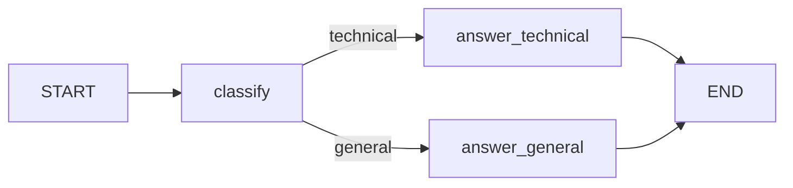
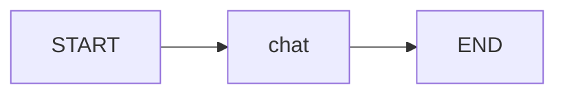
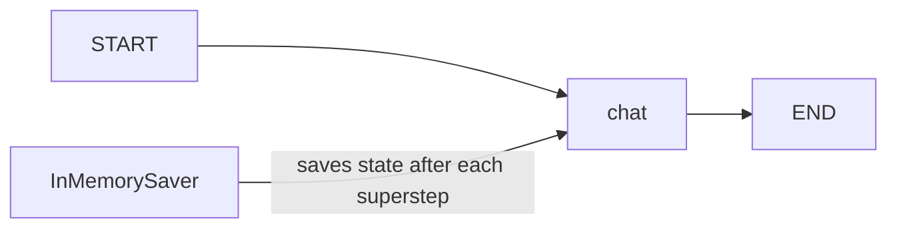
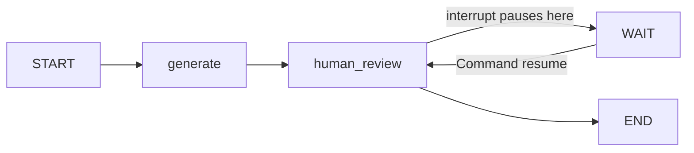
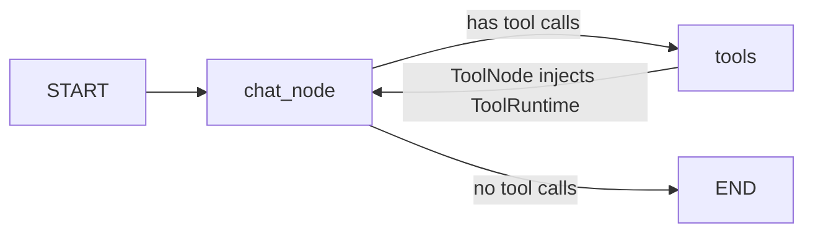

# 05 - LangGraph Core Concepts

This notebook covers the core building blocks of LangGraph, the orchestration framework built on top of LangChain for building stateful, multi-step agent workflows.

**Topics covered:**
- Section 1: StateGraph and custom graphs
- Section 2: State reducers and `add_messages`
- Section 3: Checkpointing with `InMemorySaver`
- Section 4: Human-in-the-loop with `interrupt` and `Command`
- Section 5: ToolRuntime and dependency injection in tools

```python
# suppress warnings for clean output
import warnings
warnings.filterwarnings('ignore')

!pip install -q langgraph langchain_core langchain langchain_openai
```

## Section 1 - StateGraph and Custom Graphs

### Key concepts

**`StateGraph`** is a builder, not a Runnable. It defines the structure of the graph (nodes, edges, state schema) but cannot be invoked directly. `compile()` transforms it into a `CompiledStateGraph`, which is a Runnable that exposes `.invoke()`, `.stream()`, and `.batch()`.

This mirrors the TensorFlow pattern: `model = Sequential([...])` followed by `model.compile()`. The builder is the blueprint; the compiled graph is the executable.

**Components:**
- `TypedDict` defines the state schema (keys and types). It is a static contract, not a data container.
- A **node** is a Python function `fn(state: State) -> dict` that returns only the keys it modifies.
- `add_edge(a, b)` creates a fixed transition. `add_conditional_edges(node, routing_fn)` creates a conditional transition based on the current state.
- `START` and `END` are virtual nodes. `START` must not be added with `add_node`.
- Default update behavior is **last-write-wins**: each node output overwrites the previous value for that key.



```python
from typing_extensions import TypedDict
from langgraph.graph import START, END, StateGraph
```

```python
class State(TypedDict):
    question: str
    answer: str

def classify(state: State):
    if "code" in state["question"]:
        return {"answer": "technical"}
    else:
        return {"answer": "general"}

def answer_general(state: State):
    return {"answer": "Answering a general question."}

def answer_technical(state: State):
    return {"answer": "Answering a technical question."}

def routing_fn(state: State) -> str:
    if state["answer"] == "technical":
        return "answer_technical"
    else:
        return "answer_general"
```

```python
builder = StateGraph(State)
builder.add_node("classify", classify)
builder.add_node(answer_general)
builder.add_node(answer_technical)

builder.add_edge(START, "classify")
builder.add_conditional_edges("classify", routing_fn)
builder.add_edge("answer_general", END)
builder.add_edge("answer_technical", END)

graph = builder.compile()
```

```python
# Technical question: contains the word 'code'
graph.invoke({"question": "I want to understand this bug in my code"})
```

```python
# General question: does not contain 'code'
graph.invoke({"question": "What is the longest-living mammal?"})
```

## Section 2 - State Reducers and `add_messages`

### Key concepts

By default, state updates use **last-write-wins**: each new value overwrites the previous one. For a message history, this means the agent forgets everything after each step.

A **reducer** solves this by defining how to combine the existing value with the incoming update, rather than replacing it. This is the same principle as MapReduce: instead of overwriting, you accumulate.

`Annotated[list, reducer_fn]` attaches a reducer to a TypedDict key:
- `operator.add`: simple list concatenation
- `add_messages`: accumulates messages AND updates by ID (handles message deduplication)

**`MessagesState`** is a built-in shortcut that pre-defines `messages: Annotated[list, add_messages]`. You can extend it with custom fields via inheritance.

> `add_messages` accumulates messages **within a single invoke**, not between separate invokes. Persistence across invokes requires a checkpointer (Section 3).



```python
import os
from langgraph.graph import MessagesState, StateGraph, START, END
from langchain_openai import ChatOpenAI
from langchain_core.messages import HumanMessage, SystemMessage

OPENROUTER_API_KEY = os.environ.get("OPENROUTER_API_KEY", "your-api-key-here")

llm = ChatOpenAI(
    api_key=OPENROUTER_API_KEY,
    base_url="https://openrouter.ai/api/v1",
    model="arcee-ai/trinity-large-preview:free"
)
```

```python
# MessagesState already includes: messages: Annotated[list, add_messages]
# We extend it with a custom field
class State(MessagesState):
    summary: str
```

```python
def chat(state: State):
    response = llm.invoke(state["messages"])
    # Return a list: add_messages reducer accumulates it into the existing messages
    return {"messages": [response]}
```

```python
builder = StateGraph(State)
builder.add_node(chat)
builder.add_edge(START, "chat")
builder.add_edge("chat", END)

graph = builder.compile()
```

### Without a checkpointer: no memory between invokes

Each `invoke` starts from scratch. To simulate memory, we manually pass the full history from the previous result.

```python
# Two independent invokes: the second one has no knowledge of the first
result1 = graph.invoke({"messages": [HumanMessage("Hello, my name is Yassine")]})
result2 = graph.invoke({"messages": [HumanMessage("What is my name?")]})

# result2 will not know the name: each invoke is stateless
result2["messages"][-1].content
```

```python
# Manual memory: pass the full history from result1 into the next invoke
result1 = graph.invoke({"messages": [HumanMessage("Hello, my name is Yassine")]})
result2 = graph.invoke({"messages": result1["messages"] + [HumanMessage("What is my name?")]})

# Now the LLM has the full conversation history
result2["messages"][-1].content
```

## Section 3 - Checkpointing with `InMemorySaver`

### Key concepts

A **checkpointer** automatically saves the state after each superstep. This eliminates the need to manually pass history between invokes.

**`InMemorySaver`** stores state in RAM. In production, use a persistent backend such as `SqliteSaver` or `PostgresSaver`.

The `config` parameter is **mandatory** and must follow this exact structure:
```python
config = {"configurable": {"thread_id": "1"}}
```

- `thread_id` identifies the conversation. Two different `thread_id` values are fully isolated.
- On each invoke, the graph starts from `START`, but loads the saved state for the given thread.
- Only the **new message** needs to be passed on subsequent invokes. The history is loaded automatically.



```python
from langgraph.checkpoint.memory import InMemorySaver

checkpointer = InMemorySaver()
graph = builder.compile(checkpointer=checkpointer)
```

```python
config = {"configurable": {"thread_id": 1}}

graph.invoke({"messages": [HumanMessage("Hello, my name is Yassine Handane")]}, config)
```

```python
# Only the new message is passed: the checkpointer loads the full history automatically
graph.invoke({"messages": [HumanMessage("What is my last name?")]}, config)
```

## Section 4 - Human-in-the-Loop

### Key concepts

LangGraph supports pausing graph execution to wait for human input. There are two approaches:

- **Static breakpoints** (`interrupt_before` / `interrupt_after` at compile time): useful for debugging, not recommended for production.
- **Dynamic interrupts** (`interrupt()` inside a node): the recommended approach for production.

**`interrupt(value)`** pauses the graph and exposes `value` in the result under `__interrupt__`. The graph state is saved by the checkpointer.

**`Command(resume=value)`** resumes execution. The `value` becomes the return value of the `interrupt()` call inside the node.

> A checkpointer is mandatory for `interrupt` to work: the graph state must be persisted between the pause and the resume.



```python
from langgraph.types import interrupt, Command

def generate(state: State):
    response = llm.invoke(state["messages"])
    return {"messages": [response]}

def human_review(state: State):
    # Pauses execution and exposes the value in __interrupt__
    answer = interrupt("Do you approve this action?")
    return {"messages": [HumanMessage(answer)]}
```

```python
checkpointer = InMemorySaver()

builder = StateGraph(State)
builder.add_node(generate)
builder.add_node(human_review)
builder.add_edge(START, "generate")
builder.add_edge("generate", "human_review")
builder.add_edge("human_review", END)

graph = builder.compile(checkpointer=checkpointer)
config = {"configurable": {"thread_id": 2}}
```

```python
# First invoke: the graph pauses at human_review
result = graph.invoke(
    {"messages": [HumanMessage("What is the capital of France?")]},
    config
)

# __interrupt__ confirms the graph is paused
print(result["__interrupt__"])
```

```python
# Resume execution: Command(resume=value) passes the value back to interrupt()
graph.invoke(Command(resume="Yes"), config)
```

```python
# Inspect the full conversation history stored in the checkpointer
for msg in graph.get_state(config).values["messages"]:
    msg.pretty_print()
```

## Section 5 - ToolRuntime: Dependency Injection in Tools

### Key concepts

In standard LangChain tools (NB04), tools only receive the arguments the LLM explicitly passes. They have no access to the conversation history, user identity, or long-term memory unless those values are exposed as tool arguments visible to the LLM.

**`ToolRuntime`** solves this by injecting dependencies automatically. It is a special parameter that LangGraph (via `ToolNode`) injects into tools at runtime. The LLM never sees it in the tool schema.

**The 6 attributes of `ToolRuntime`:**

| Attribute | Type | Mutable | Description |
|---|---|---|---|
| `runtime.state` | dict | Yes | Current graph state (messages, custom fields) |
| `runtime.context` | dataclass | No | Static config passed at invoke time (user_id, session) |
| `runtime.store` | BaseStore | Yes | Long-term memory persisted across conversations |
| `runtime.stream_writer` | callable | No | Emits real-time updates during tool execution |
| `runtime.config` | RunnableConfig | No | thread_id, callbacks, tags |
| `runtime.tool_call_id` | str | No | Unique ID of the current tool call |

> `runtime` is a **reserved parameter name**: it cannot be used as a regular tool argument. The same applies to `config`.



```python
from dataclasses import dataclass
from langchain.tools import tool, ToolRuntime
from langgraph.prebuilt import ToolNode, tools_condition
from langgraph.store.memory import InMemoryStore
```

### 5.1 - `runtime.state`: short-term memory

`runtime.state` gives a tool read access to the current graph state. It is the same object that nodes receive as their `state` parameter. The LLM never sees this parameter in the tool schema.

```python
@tool
def get_message_count(runtime: ToolRuntime) -> str:
    """Return the number of messages in the current conversation."""
    return str(len(runtime.state["messages"]))
```

```python
llm_binded = llm.bind_tools([get_message_count])

def chat_node(state: State):
    response = llm_binded.invoke(state["messages"])
    return {"messages": [response]}

builder = StateGraph(State)
tool_node = ToolNode([get_message_count])

builder.add_node("tools", tool_node)
builder.add_node(chat_node)
builder.add_edge(START, "chat_node")
builder.add_conditional_edges("chat_node", tools_condition)
builder.add_edge("tools", "chat_node")

checkpointer = InMemorySaver()
graph = builder.compile(checkpointer)

config = {"configurable": {"thread_id": 2}}
```

```python
graph.invoke({"messages": [HumanMessage("How are you?")]}, config)
graph.invoke({"messages": [HumanMessage("How many messages are in our conversation?")]}, config)
```

### 5.2 - `runtime.context`: static configuration

`runtime.context` provides access to immutable configuration passed at invoke time via `context=`. It is defined as a dataclass and typed via `ToolRuntime[Context]`.

Use `ToolRuntime[Context]` (with the generic type) whenever you access `runtime.context`. Without it, `runtime.context` is `None`.

The `context_schema` parameter must be declared at `StateGraph` construction time.

```python
@dataclass
class Context:
    user_id: str
```

```python
@tool
def greet_user(runtime: ToolRuntime[Context]) -> str:
    """Greet the current user by their ID."""
    return f"Hello, your user ID is: {runtime.context.user_id}"
```

```python
llm_binded = llm.bind_tools([get_message_count, greet_user])

def chat_node(state: State):
    response = llm_binded.invoke(state["messages"])
    return {"messages": [response]}

# context_schema declares which Context dataclass this graph accepts
builder = StateGraph(State, context_schema=Context)
tool_node = ToolNode([greet_user, get_message_count])

builder.add_node(chat_node)
builder.add_node("tools", tool_node)
builder.add_edge(START, "chat_node")
builder.add_conditional_edges("chat_node", tools_condition)
builder.add_edge("tools", "chat_node")

checkpointer = InMemorySaver()
graph = builder.compile(checkpointer)
```

```python
config = {"configurable": {"thread_id": 4}}

# context is passed at invoke time: the LLM never sees user_id as a tool argument
graph.invoke(
    {"messages": [HumanMessage("Greet me!")]},
    config=config,
    context=Context(user_id="Yassine_123")
)
```

### 5.3 - `runtime.store`: long-term memory

`runtime.store` provides access to a `BaseStore` instance that persists data **across conversations and threads**. This is fundamentally different from the checkpointer:

| | `InMemorySaver` (checkpointer) | `InMemoryStore` (store) |
|---|---|---|
| Survives across threads | No | Yes |
| Access pattern | via `thread_id` | via `namespace / key` |
| Passed at compile | `compile(checkpointer=...)` | `compile(store=...)` |

The store uses a **namespace / key** pattern to organize data:
```python
store.put(("namespace",), "key", {"field": "value"})  # write
result = store.get(("namespace",), "key")              # read
result.value                                            # the stored dict
```

> For production, replace `InMemoryStore` with `PostgresStore` or another persistent backend.

```python
@tool
def save_preference(preference_key: str, preference_value: str, runtime: ToolRuntime[Context]) -> str:
    """Save a user preference to long-term memory."""
    runtime.store.put(
        ("preferences",),
        runtime.context.user_id,
        {preference_key: preference_value}
    )
    return f"Saved {preference_key} = {preference_value}"

@tool
def get_preference(runtime: ToolRuntime[Context]) -> str:
    """Retrieve user preferences from long-term memory."""
    result = runtime.store.get(("preferences",), runtime.context.user_id)
    return str(result.value) if result else "No preferences found"
```

```python
llm_binded = llm.bind_tools([get_message_count, greet_user, save_preference, get_preference])

def chat_node(state: State):
    response = llm_binded.invoke(state["messages"])
    return {"messages": [response]}

builder = StateGraph(State, context_schema=Context)
tool_node = ToolNode([save_preference, get_message_count, greet_user, get_preference])

builder.add_node(chat_node)
builder.add_node("tools", tool_node)
builder.add_edge(START, "chat_node")
builder.add_conditional_edges("chat_node", tools_condition)
builder.add_edge("tools", "chat_node")

store = InMemoryStore()
checkpointer = InMemorySaver()
graph = builder.compile(store=store, checkpointer=checkpointer)
```

```python
config = {"configurable": {"thread_id": 5}}

# Save a preference
graph.invoke(
    {"messages": [HumanMessage("Save my language preference as French")]},
    config=config,
    context=Context(user_id="Yassine_123")
)
```

```python
# Retrieve from a completely different thread: the store persists across thread boundaries
config_new = {"configurable": {"thread_id": 999}}

graph.invoke(
    {"messages": [HumanMessage("What is my language preference?")]},
    config=config_new,
    context=Context(user_id="Yassine_123")
)
```

The store returns the preference saved in thread 5, even though this invoke uses thread 999. This demonstrates that `InMemoryStore` is independent of `thread_id`: it is keyed by `user_id`, not by conversation.
