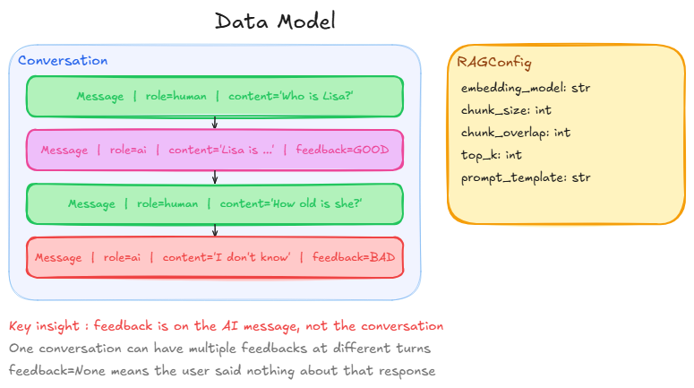
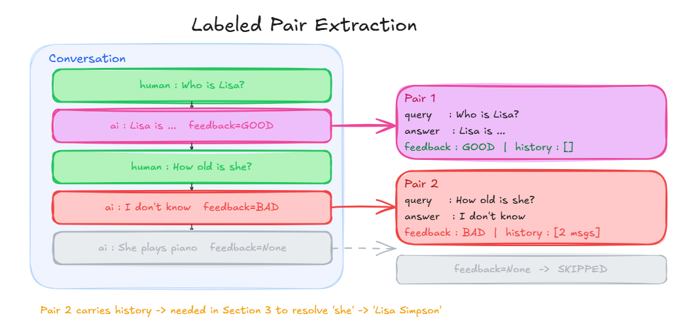
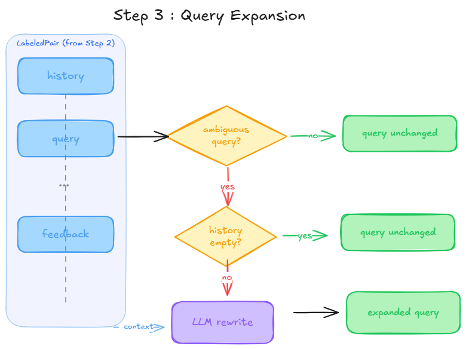
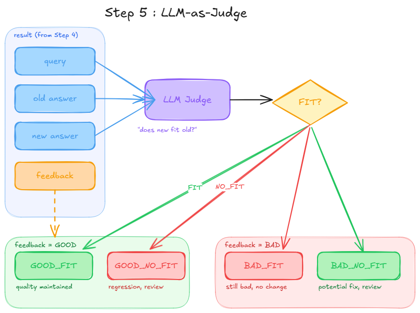

# RAG Re-Evaluation Pipeline

**Author:** Yassine Handane  
**Context:** Take-home task, The QA Company

---

## Problem Statement

#### Context

We have a RAG system running in production.
Users interact with it through conversations and give feedback on each AI response: GOOD, BAD, or nothing.

Over time we collect a history of conversations with these feedback signals.

#### The Problem

We want to change the RAG configuration, but we cannot just deploy the new config and wait for new feedback.
That is too slow, too costly, and risks degrading the user experience.

#### The Question

> Can we use the feedback we already have to decide whether the new config is better than the old one before deploying it?

#### Our Approach

We treat historical conversations with feedback as an offline test dataset.

1. Extract every (query, old_answer, feedback) pair from past conversations
2. Expand ambiguous queries using conversation history
3. Re-run those same queries through the new RAG config
4. Use an LLM-as-Judge to compare old answer vs new answer
5. Compute ratios to compare both configs objectively

## Step 1 : Data Modeling

### What is it

Before writing any logic, we define the objects we are going to manipulate: conversations, messages, and feedback.

### What problem does it solve

Everything downstream depends on this structure. Without clear data modeling upfront, we cannot extract labeled pairs in Step 2, expand queries in Step 3, or compute metrics at the end.

### The key insight

The most important design decision is **where feedback lives**.

Feedback is attached to each AI message individually, not to the conversation as a whole. A conversation has multiple turns. The user might love the first AI response and hate the second.

```
Conversation
    Human : "Who is Lisa?"
    AI    : "Lisa is a character..."   <- feedback = GOOD
    Human : "How old is she?"
    AI    : "I don't know"             <- feedback = BAD
    Human : "What does she play?"
    AI    : "She plays saxophone"      <- feedback = None
```

`feedback = None` means the user gave no signal on that response. We ignore those: no ground truth, no evaluation.

### Diagram

<div align="center">
  
</div>

```python
from dataclasses import dataclass, field
from typing import Optional, List
from enum import Enum


class Feedback(Enum):
    GOOD = "good"
    BAD  = "bad"


@dataclass
class Message:
    role: str                            # "human" or "ai"
    content: str
    feedback: Optional[Feedback] = None  # only relevant for AI messages


@dataclass
class Conversation:
    id: str
    messages: List[Message] = field()
```

### Example

```python
conv = Conversation(
    id="conv_001",
    messages=[
        Message(role="human", content="Who is Lisa?"),
        Message(role="ai",    content="Lisa is a character...", feedback=Feedback.GOOD),
        Message(role="human", content="How old is she?"),
        Message(role="ai",    content="I don't know",           feedback=Feedback.BAD),
        Message(role="human", content="What does she play?"),
        Message(role="ai",    content="She plays saxophone",    feedback=None),
    ]
)
```

## Step 2 : Labeled Pair Extraction

### What is it

We iterate over all conversations and extract every **(query, old_answer, feedback, history)** tuple where the AI message received a feedback signal.

### What problem does it solve

Our data is nested inside conversations. We need to flatten it into individual testable pairs that we can re-run one by one through the new RAG config.

### How it connects to Step 1

We loop over `Conversation.messages`, find every AI message where `feedback != None`, grab the human message just before it as the query, and keep everything before that turn as history.

### The key insight

When we find a labeled AI message at index `i`:

```
messages[i-1]  ->  the human query
messages[:i-1] ->  the history before this turn
messages[i]    ->  the AI answer + feedback
```

> `history` is empty for the first turn, but carries previous messages for all subsequent turns. This is what we need in Step 3 to expand "How old is she?" into "How old is Lisa?"

### Diagram
<div align="center">
  
</div>

```python
@dataclass
class LabeledPair:
    conv_id:    str
    query:      str
    old_answer: str
    feedback:   Feedback
    history:    List[Message]


def extract_labeled_pairs(conversations: List[Conversation]) -> List[LabeledPair]:
    """
    For each conversation, extract every (query, old_answer, feedback, history)
    tuple where the AI message received a feedback signal.
    Skips AI messages with feedback=None.
    """
    pairs = []

    for conv in conversations:
        for i, message in enumerate(conv.messages):

            if message.role != "ai" or message.feedback is None:
                continue

            pairs.append(LabeledPair(
                conv_id    = conv.id,
                query      = conv.messages[i - 1].content,
                old_answer = message.content,
                feedback   = message.feedback,
                history    = conv.messages[:i - 1]
            ))

    return pairs
```

## Step 3 : Query Expansion

### What is it

Before re-running a query through the new RAG config, we need to make sure the query is **self-contained**.

> Basically what I do, is that follow-up queries are automatically rewritten with their missing context before hitting the retriever.

### What problem does it solve

The retriever has no memory. If you send "How old is she?" directly, it cannot know who "she" is. The retrieval will fail, and the new config will look bad for the wrong reason.

### How it connects to Step 2

Every `LabeledPair` carries a `history` field. We pass that history to the LLM so it can rewrite ambiguous queries before we send them to the new config.

### The key insight

We delegate the decision entirely to the LLM. The prompt instructs it to rewrite the query if it is ambiguous, and to return it unchanged if it is already self-contained.

```
query    : "How old is she?"
expanded : "How old is Lisa Simpson?"

query    : "What does Lisa play?"
expanded : "Who does Lisa play?"  <- returned unchanged
```

> If `history` is empty, we skip the LLM call entirely and return the query as is.

### Diagram
<div align="center">
  
</div>

```python
def expand_query(query: str, history: List[Message], llm) -> str:
    """
    Rewrites the query into a self-contained question using conversation history.
    If history is empty, returns the query unchanged.
    The LLM decides whether rewriting is needed: if the query is already
    self-contained, it returns it unchanged.
    Mirrors the Query Expansion feature in QAnswer Retriever Settings.
    """
    if not history:
        return query

    history_text = "\n".join(
        f"{m.role.capitalize()}: {m.content}" for m in history
    )

    prompt = f"""Given this conversation history:
{history_text}

Rewrite the following question to be fully self-contained.
Replace all ambiguous pronouns with their actual referents.
If the question is already self-contained, return it unchanged.
Return only the question, nothing else.

Question: {query}
"""
    return llm.invoke(prompt)
```

## Step 4 : Re-run with the New Config

### What is it

We take each expanded query from Step 3 and run it through the new RAG config to collect a new answer.

### How it connects to Step 3

We now have a clean, self-contained query for every labeled pair. We run it through the new RAG and store the result alongside the old answer so Step 5 can compare them.

> At this point each result carries everything we need for Step 5: the original query, the old answer, the new answer, and the original user feedback.

```python
def rerun_on_new_rag(pairs: List[LabeledPair], new_rag, llm) -> List[dict]:
    """
    For each labeled pair, expand the query if needed,
    then run it through the new RAG config.
    Returns a list of results with old and new answers side by side.
    """
    results = []

    for pair in pairs:
        expanded_query = expand_query(pair.query, pair.history, llm)
        new_answer     = new_rag.invoke(expanded_query)

        results.append({
            "conv_id"    : pair.conv_id,
            "query"      : pair.query,
            "expanded"   : expanded_query,
            "old_answer" : pair.old_answer,
            "new_answer" : new_answer,
            "feedback"   : pair.feedback,
        })

    return results
```

## Step 5 : LLM-as-Judge

### What is it

We use an LLM to check whether the new answer **fits** the old answer semantically. That is the only judgment we need.

### What problem does it solve

We cannot compare answers with string matching. Two answers can be worded differently but carry the same meaning. We need semantic comparison, which is exactly what an LLM is good at.

### How it connects to Step 4

Each result from Step 4 carries `old_answer`, `new_answer`, and `feedback`. We pass all three to the judge. The feedback tells the judge what kind of answer the old one was: that is the anchor for the comparison.

### The key insight

The judge does not decide if the new answer is good or bad in absolute terms. It only asks one question:

> Does the new answer fit the old answer?

Then we combine the raw FIT / NO_FIT signal with the original feedback to produce one of four explicit verdicts:

```
GOOD_FIT    : feedback=GOOD, new answer fits      -> quality maintained
GOOD_NO_FIT : feedback=GOOD, new answer no fit    -> something changed, needs review
BAD_FIT     : feedback=BAD,  new answer fits      -> still bad, no improvement
BAD_NO_FIT  : feedback=BAD,  new answer no fit    -> something changed, needs review
```

This encoding makes Step 6 trivial: no joining, no combining, just counting and computing ratios.

### Diagram

<div align="center">
  
</div>

```python
class Verdict(Enum):
    GOOD_FIT    = "GOOD_FIT"     # feedback=GOOD, new answer fits
    GOOD_NO_FIT = "GOOD_NO_FIT"  # feedback=GOOD, new answer does not fit
    BAD_FIT     = "BAD_FIT"      # feedback=BAD,  new answer fits (still bad)
    BAD_NO_FIT  = "BAD_NO_FIT"   # feedback=BAD,  new answer does not fit (potential fix)


def judge(result: dict, llm) -> Verdict:
    """
    Asks the LLM if the new answer fits the old answer semantically.
    Combines the raw FIT/NO_FIT signal with the original feedback
    to produce one of four explicit verdicts.
    """
    prompt = f"""You are comparing two answers to the same question.

Question   : {result['query']}
Old answer : {result['old_answer']}
New answer : {result['new_answer']}

Does the new answer fit the old answer semantically?
Reply with only one word: FIT or NO_FIT.
"""
    raw      = llm.invoke(prompt).strip().upper()
    feedback = result["feedback"]

    if feedback == Feedback.GOOD and raw == "FIT":
        return Verdict.GOOD_FIT
    elif feedback == Feedback.GOOD and raw == "NO_FIT":
        return Verdict.GOOD_NO_FIT
    elif feedback == Feedback.BAD and raw == "FIT":
        return Verdict.BAD_FIT
    else:
        return Verdict.BAD_NO_FIT


def judge_all(results: List[dict], llm) -> List[dict]:
    """Runs the judge on every result and attaches the verdict to each entry."""
    for result in results:
        result["verdict"] = judge(result, llm)
    return results
```

## Step 6 : Metrics

### What is it

We compute ratios from the four verdict categories to compare the new config against the old one with concrete numbers.

### How it connects to Step 5

Each verdict from Step 5 belongs to one of two feedback groups: GOOD or BAD. Within each group, we compute the share of answers that stayed the same (FIT) vs changed (NO_FIT).

### The ratios

```
good_maintenance_rate = GOOD_FIT    / total GOOD feedback
good_change_rate      = GOOD_NO_FIT / total GOOD feedback

bad_persistence_rate  = BAD_FIT     / total BAD feedback
bad_change_rate       = BAD_NO_FIT  / total BAD feedback
```

The two most important numbers:

- **good_maintenance_rate**: how well the new config preserves what was already working. We want this high.
- **bad_change_rate**: how often the new config changed a bad answer. We want this high too, as it signals potential fixes.

### Reading the results

```
good_maintenance_rate high  +  bad_change_rate high  ->  new config is promising
good_maintenance_rate low                            ->  new config broke things
bad_persistence_rate  high                           ->  new config changed nothing
```

> `BAD_NO_FIT` cases flagged by `bad_change_rate` are candidates for human review. The system knows something changed, but cannot confirm it is a fix. Only a human can validate that.

```python
def compute_metrics(results: List[dict]) -> dict:
    """
    Computes ratios per feedback category to compare two RAG configs.

    good_maintenance_rate : how much of what was good stayed good
    good_change_rate      : how much of what was good changed
    bad_persistence_rate  : how much of what was bad stayed bad
    bad_change_rate       : how much of what was bad changed (potential fixes)
    """
    verdicts = [r["verdict"] for r in results]

    good_fit    = verdicts.count(Verdict.GOOD_FIT)
    good_no_fit = verdicts.count(Verdict.GOOD_NO_FIT)
    bad_fit     = verdicts.count(Verdict.BAD_FIT)
    bad_no_fit  = verdicts.count(Verdict.BAD_NO_FIT)

    total_good = good_fit + good_no_fit
    total_bad  = bad_fit  + bad_no_fit

    return {
        "good_maintenance_rate" : good_fit    / total_good if total_good else 0,
        "good_change_rate"      : good_no_fit / total_good if total_good else 0,
        "bad_persistence_rate"  : bad_fit     / total_bad  if total_bad  else 0,
        "bad_change_rate"       : bad_no_fit  / total_bad  if total_bad  else 0,
    }


def print_metrics(metrics: dict):
    """Prints a readable comparison summary between old and new config."""
    print(f"good_maintenance_rate : {metrics['good_maintenance_rate']:.0%}  ->  good answers preserved")
    print(f"good_change_rate      : {metrics['good_change_rate']:.0%}  ->  good answers that changed")
    print(f"bad_persistence_rate  : {metrics['bad_persistence_rate']:.0%}  ->  bad answers still bad")
    print(f"bad_change_rate       : {metrics['bad_change_rate']:.0%}  ->  bad answers that changed (review these)")
```
